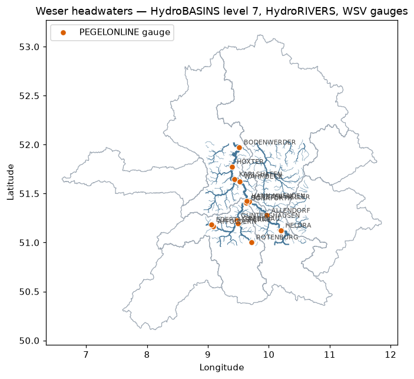

# earthkit-data-hydrology-germany

**All the data a German rainfall–runoff model needs, through one interface.**

[](https://github.com/Bluerrror/earthkit-data-hydrology-germany/actions/workflows/tests.yml)
[](LICENSE)
[](pyproject.toml)
[](https://earthkit-data.readthedocs.io/)

A bundle of [earthkit-data](https://earthkit-data.readthedocs.io/) **source
plugins** for the datasets German hydrology work keeps reaching for —
meteorological forcing, station observations, river gauges, catchments,
rivers and soil — all as `from_source(...)` calls, all free, no API keys.

| source | what you get | returns |
|--------|--------------|---------|
| `era5-timeseries`  | ERA5 / ERA5-Land point time series (1940→, via [Open-Meteo](https://open-meteo.com/)) | `to_pandas()` |
| `dwd-observations` | DWD station observations: daily/hourly/monthly climate, station catalogue | `to_pandas()` |
| `pegelonline`      | live water level / discharge at ~660 federal waterway gauges (WSV) | `to_pandas()` |
| `hydrosheds`       | HydroBASINS catchments (Pfafstetter 1–12) + HydroRIVERS river network | `to_pandas()` → GeoDataFrame |
| `buek1000`         | BÜK1000 German soil map polygons (BGR) | `to_pandas()` → GeoDataFrame |

```python
import earthkit.data as ekd

# ERA5 forcing at a catchment centroid — no CDS account needed
forcing = ekd.from_source(
    "era5-timeseries",
    latitude=51.54, longitude=9.93,
    start="1990-01-01", end="2023-12-31",
    variables=["precipitation_sum", "temperature_2m_mean",
               "et0_fao_evapotranspiration"],
).to_pandas()

# 55+ years of daily DWD climate at station Göttingen
obs = ekd.from_source(
    "dwd-observations", station=1691, period="all",
).to_pandas()

# river gauges and their last two weeks of water level
gauges = ekd.from_source("pegelonline").to_pandas()
level = ekd.from_source("pegelonline", station="HANN.MUENDEN").to_pandas()

# catchments, rivers and soil for your model domain
from earthkit_data_hydrology_germany import GERMANY
basins = ekd.from_source("hydrosheds", product="basins", level=6, bbox=GERMANY).to_pandas()
rivers = ekd.from_source("hydrosheds", product="rivers", bbox=GERMANY).to_pandas()
soils  = ekd.from_source("buek1000", bbox=[9.5, 51.3, 10.2, 51.7]).to_pandas()
```

<p align="center">
  
</p>

📓 [`examples/quickstart.ipynb`](examples/quickstart.ipynb)
[](https://colab.research.google.com/github/Bluerrror/earthkit-data-hydrology-germany/blob/main/examples/quickstart.ipynb)
builds a complete picture of one catchment: gauges on the river network,
observed vs. reanalysis climate, and the soil map underneath.

Gridded **soil properties** (pH, texture, SOC, …) live in the companion plugin
[earthkit-data-soilgrids](https://github.com/Bluerrror/earthkit-data-soilgrids).

## Install

```bash
pip install git+https://github.com/Bluerrror/earthkit-data-hydrology-germany
```

Dependencies: `earthkit-data>=1.0`, `pandas`, `geopandas`, `pyproj`.
On **Windows**, install `earthkit-data` first with `--no-deps` (its ecCodes
dependency has no Windows wheels and is only needed for GRIB — see the
[soilgrids README](https://github.com/Bluerrror/earthkit-data-soilgrids#install)
for the exact commands).

## Sources in detail

### `era5-timeseries`

| argument | default | notes |
|----------|---------|-------|
| `latitude`, `longitude` | — | scalars or equal-length lists (multi-point) |
| `start`, `end` | — | `YYYY-MM-DD`; archive reaches back to 1940, ~5 days behind real time |
| `variables` | `precipitation_sum, temperature_2m_mean` | any [Open-Meteo historical variables](https://open-meteo.com/en/docs/historical-weather-api) |
| `frequency` | `"daily"` | or `"hourly"` |
| `model` | `"era5"` | `"era5_land"` (9 km), `"best_match"`, `"cerra"`, ... |

Units land in `df.attrs["units"]`. For full gridded ERA5 use earthkit-data's
built-in `cds` source with a Copernicus account.

### `dwd-observations`

| argument | default | notes |
|----------|---------|-------|
| `station` | `None` | DWD id (`44` or `"00044"`); omit for the station catalogue with coordinates |
| `resolution` / `dataset` | `"daily"` / `"kl"` | also `daily/more_precip`, `hourly/precipitation`, `hourly/air_temperature`, `monthly/kl` |
| `period` | `"recent"` | `"recent"` (~last 500 days), `"historical"`, `"all"` (merged) |

Column names are DWD's (`RSK` precipitation, `TMK` mean temperature, `TXK`/`TNK`
max/min, ... — see the `Metadaten` in each DWD directory); `-999` is masked to NaN.

### `pegelonline`

| argument | default | notes |
|----------|---------|-------|
| `station` | `None` | shortname (`"HANN.MUENDEN"`), uuid or number; omit for the catalogue (with lon/lat, river, available timeseries) |
| `parameter` | `"W"` | water level; `"Q"` discharge where offered |
| `start` | `"P15D"` | ISO-8601 period or timestamp; the API keeps ~31 days |

Live operational values, fetched fresh on every call (never cached). For long
discharge records use the federal/state archives (GRDC, LfU portals).

### `hydrosheds`

| argument | default | notes |
|----------|---------|-------|
| `product` | `"basins"` | or `"rivers"` |
| `level` | `6` | Pfafstetter level 1–12 (basins only; higher = smaller catchments) |
| `bbox` | whole region | `[W, S, E, N]` lon/lat; `GERMANY` constant provided |
| `region` | `"eu"` | HydroSHEDS region code |

### `buek1000`

| argument | default | notes |
|----------|---------|-------|
| `bbox` | all of Germany | `[W, S, E, N]` in lon/lat |
| `to_crs` | `"EPSG:4326"` | output CRS; `None` keeps native EPSG:3034 |

## Caching

Static files (DWD zips, HydroSHEDS/BÜK archives, ERA5 archive responses) go
through earthkit's cache — set `ekd.config.set("cache-policy", "user")` to
keep them between sessions. PEGELONLINE is live data and is never cached.

## Development

```bash
pip install -e ".[test]"
pytest        # offline: URL construction, parsers, entry points
```

## Licenses & attribution

This package is Apache-2.0. The **data** have their own terms — cite/attribute
when you publish:

- **ERA5** via Open-Meteo: contains modified Copernicus Climate Change Service
  information; Open-Meteo data under CC-BY 4.0 ([Zippenfenig 2023](https://doi.org/10.5281/zenodo.7970649),
  [Hersbach et al. 2020](https://doi.org/10.1002/qj.3803)).
- **DWD**: © Deutscher Wetterdienst, [CC-BY 4.0 / GeoNutzV](https://www.dwd.de/EN/service/copyright/copyright_artikel.html) — "Quelle: Deutscher Wetterdienst".
- **PEGELONLINE**: © WSV, raw un-validated operational values, [GeoNutzV](https://www.pegelonline.wsv.de/gast/impressum).
- **HydroSHEDS / HydroBASINS / HydroRIVERS**: free with attribution per the
  [HydroSHEDS license](https://www.hydrosheds.org/page/license); cite
  [Lehner & Grill (2013)](https://doi.org/10.1002/hyp.9740).
- **BÜK1000**: © BGR, Hannover — "Bodenübersichtskarte 1:1.000.000 (BÜK1000)".
